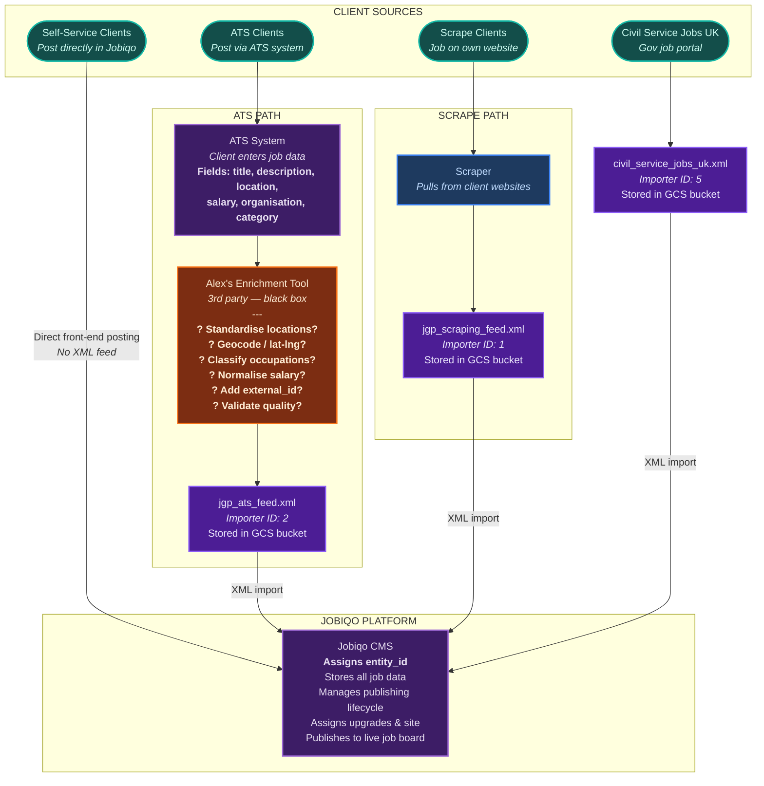

# JGP Upstream Data Flow & Google Places API Decision

Standalone Mermaid source for the 3 upstream diagrams added to `process_flow.html`.
Edit here or paste into [mermaid.live](https://mermaid.live) for visual editing.

---

## Diagram 1: How Jobs Enter Jobiqo (4 Intake Paths)

Four distinct paths converge into Jobiqo. Alex's enrichment tool (ATS path) is a black box.

---

## Diagram 2: Data Fields at Each Stage

What fields exist and get added at each transformation point, from raw posting to dashboard.

```mermaid
flowchart TD
    S1["<b>STAGE 1: Raw Job Posting</b><br/><i>Client provides:</i><br/>---<br/>Title<br/>Description<br/>Location (free text)<br/>Salary (text or structured)<br/>Organisation name<br/>Employment type<br/>Category / sector"]:::client

    S2["<b>STAGE 2: Alex's Enrichment</b><br/><i>ATS path only — unknown transforms</i><br/>---<br/><b>INVESTIGATE:</b><br/>? Location standardisation?<br/>? Geocoding / lat-lng?<br/>? Occupation classification?<br/>? Salary normalisation?<br/>? external_id generation?<br/>? Data quality validation?<br/>---<br/>Output: jgp_ats_feed.xml"]:::gap

    S3["<b>STAGE 3: XML Feed Schema</b><br/><i>All 3 feeds share this structure:</i><br/>---<br/>external_id (feed id hash)<br/>title<br/>organization_id + org_profile_name<br/>locations (pipe-delimited)<br/>employment_type<br/>occupational_fields (pipe-delimited)<br/>category · contract_type<br/>min_salary · max_salary · salary_exact<br/>currency_code · salary_unit · salary_free_text<br/>publishing_date · expiration_date"]:::supp

    S4["<b>STAGE 4: Jobiqo Platform</b><br/><i>Jobiqo adds:</i><br/>---<br/>entity_id (unique Jobiqo ID)<br/>Publishing workflow_state<br/>Importer ID + importer name<br/>Upgrades (Featured, Highlight, Bump)<br/>Site assignment (JGP vs LGJobs)<br/>URL / slug<br/>Original publishing date"]:::external

    S5["<b>STAGE 5: GA4 Events</b><br/><i>Per user interaction on live site:</i><br/>---<br/>event_name (job_visit / job_apply_start)<br/>event_date + timestamp<br/>device_category · browser · OS<br/>source · medium · campaign<br/>page_referrer<br/>country · city (user location)<br/>new_vs_returning<br/><i>+ echoes: title, org_name, salary</i>"]:::king

    S6["<b>STAGE 6: BigQuery Enrichment</b><br/><i>Pipeline adds:</i><br/>---<br/>Step 2.1: town_city, uk_region<br/><i>(parsed from locations string + 16K lookup)</i><br/><br/>Step 2.5: hq_region, hq_county<br/><i>(from client_hq_addresses manual lookup)</i><br/><br/>Step 3: COALESCE all overlapping fields<br/><i>(GA4 is king, metadata fills gaps)</i><br/>Region: COALESCE(hq_region, vacancy_loc)<br/><br/>Step 5 (Python): occupation (1st value),<br/>media_channel (20 categories),<br/>salary_annual (normalised to GBP/yr)"]:::process

    S1 --> S2
    S1 -->|"Scrape + CS + Self-Service<br/>(bypass Alex)"| S3
    S2 --> S3
    S3 --> S4
    S4 --> S5
    S5 --> S6

    classDef client fill:#134e4a,stroke:#14b8a6,stroke-width:2px,color:#ccfbf1
    classDef external fill:#3d1d66,stroke:#9c67d3,stroke-width:2px,color:#e8e0f2
    classDef gap fill:#7c2d12,stroke:#f97316,stroke-width:2px,color:#ffedd5
    classDef supp fill:#4c1d95,stroke:#8b5cf6,stroke-width:2px,color:#ede9fe
    classDef king fill:#78350f,stroke:#f59e0b,stroke-width:2px,color:#fef3c7
    classDef process fill:#1e3a5f,stroke:#3b82f6,stroke-width:2px,color:#bfdbfe
```

---

## Diagram 3: Google Places API — Where to Integrate?

Three possible integration points with trade-offs for each.

```mermaid
flowchart TD
    Q{{"Where should Google Places API<br/>be integrated?"}}:::process

    subgraph A["OPTION A: With Alex (Upstream Enrichment)"]
        direction TB
        A1["<b>When:</b> Before data reaches Jobiqo<br/><i>Inside Alex's enrichment tool</i>"]:::external
        A2["<b>Covers:</b> ATS clients only<br/><i>Not Scrape, Civil Service, or Self-Service</i>"]:::gap
        A3["<b>Data available:</b><br/>Raw location text from ATS client<br/>? Other fields Alex already has"]:::gap
        A4["<b>Pros:</b><br/>Enriched data flows to ALL consumers<br/>Live site shows better locations<br/>Enrichment runs once per job"]:::client
        A5["<b>Cons:</b><br/>Only 1 of 4 paths covered<br/>Dependency on 3rd-party developer<br/>No visibility into API costs or errors<br/>Must investigate Alex's stack first"]:::gap
    end

    subgraph B["OPTION B: In Jobiqo (Platform-Level)"]
        direction TB
        B1["<b>When:</b> During import/publish<br/><i>All 4 paths converge here</i>"]:::external
        B2["<b>Covers:</b> ALL 4 intake paths"]:::client
        B3["<b>Data available:</b><br/>All job fields from all sources<br/>entity_id assigned<br/>Full location string"]:::external
        B4["<b>Pros:</b><br/>Single integration covers everything<br/>Live site shows enriched locations<br/>Jobiqo search / filtering benefits<br/>entity_id available for tracking"]:::client
        B5["<b>Cons:</b><br/>Requires Jobiqo platform changes<br/>Unknown if Jobiqo supports hooks/plugins<br/>May need Jobiqo developer involvement<br/>Processing overhead on publish"]:::gap
    end

    subgraph C["OPTION C: Downstream Pipeline (Your BigQuery)"]
        direction TB
        C1["<b>When:</b> Daily refresh pipeline<br/><i>After Step 2 feed sync</i>"]:::process
        C2["<b>Covers:</b> All jobs in analytics<br/><i>But NOT the live site</i>"]:::table
        C3["<b>Data available:</b><br/>All job_metadata fields<br/>entity_id + external_id<br/>Raw locations string<br/>Already-parsed town_city"]:::table
        C4["<b>Pros:</b><br/>Full control in your codebase<br/>No 3rd-party dependency<br/>Batch API calls efficiently<br/>Cache results in BQ lookup table<br/>Ship fastest — days not weeks"]:::client
        C5["<b>Cons:</b><br/>Only benefits analytics dashboard<br/>Live site still shows raw locations<br/>Jobiqo search unimproved<br/>API costs scale with new vacancies"]:::gap
    end

    Q --> A
    Q --> B
    Q --> C

    REC["<b>Suggested sequence:</b><br/>1. Investigate what Alex's tool already does<br/>2. Ask Jobiqo: location enrichment hooks?<br/>3. Ship Option C now for analytics<br/>4. Plan Option B for live site long-term"]:::display

    A --> REC
    B --> REC
    C --> REC

    classDef client fill:#134e4a,stroke:#14b8a6,stroke-width:2px,color:#ccfbf1
    classDef external fill:#3d1d66,stroke:#9c67d3,stroke-width:2px,color:#e8e0f2
    classDef gap fill:#7c2d12,stroke:#f97316,stroke-width:2px,color:#ffedd5
    classDef process fill:#1e3a5f,stroke:#3b82f6,stroke-width:2px,color:#bfdbfe
    classDef table fill:#064e3b,stroke:#10b981,stroke-width:2px,color:#d1fae5
    classDef display fill:#164e63,stroke:#06b6d4,stroke-width:2px,color:#cffafe
```

---

## Color Key

| Color | Class | Meaning |
|-------|-------|---------|
| Teal | `client` | Client sources / origins |
| Purple | `external` | External platforms (ATS, Jobiqo, Alex) |
| Orange | `gap` | Unknown / needs investigation |
| Amber | `king` | GA4 primary source |
| Violet | `supp` | Supplementary sources (XML feeds) |
| Slate | `lookup` | Lookup / reference tables |
| Blue | `process` | Processing steps |
| Green | `table` | BigQuery tables |
| Pink | `app` | App-level transforms |
| Cyan | `display` | Dashboard output |

## Investigation Questions for Alex

Before deciding on Google Places API placement:

1. What does Alex's enrichment tool currently do to the data?
2. Does it do any location standardisation or geocoding already?
3. What is the output schema — identical to the other XML feeds or extra fields?
4. Could Places API be added to Alex's tool? What cost/timeline?
